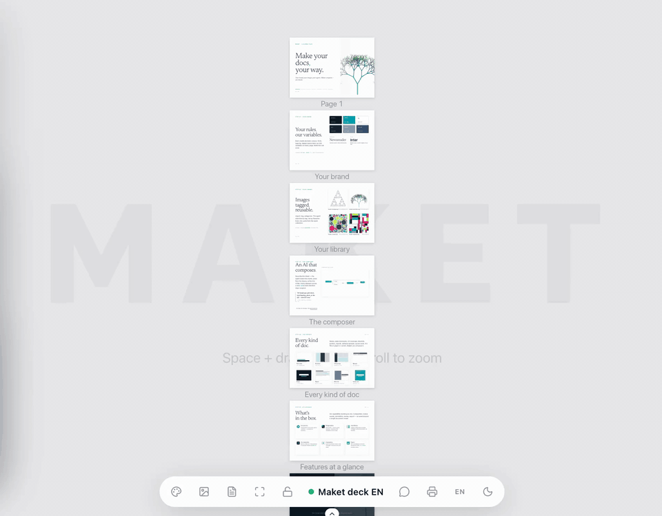

# Maket

**Turn your AI assistant into a visual designer.** Describe what you want — a poster, a flyer, a product label, a social post — and the AI assistant composes it as an HTML/CSS document with precise typography, brand chartes, and your image library. A live preview updates in real time. Export to PDF or send via Gmail when you're done.

[](LICENSE)
[](https://nodejs.org/)
[](https://modelcontextprotocol.io/)
[](#contributing)

<p align="center">
  
</p>

<p align="center">
  <em>60 seconds · charte → library → AI composition → every kind of doc → export.</em>
</p>

---

## Why Maket

Your AI assistant is good at writing. But design is about space, hierarchy, and rhythm — and that happens in layout, not prose. Maket gives the AI assistant a **real canvas** (HTML/CSS pages sized in millimeters), a **live preview** that reflects every change, and an **asset + brand library** so output stays consistent across documents. You stay in the conversation; the AI assistant handles the craft.

## Features

- **Live preview** — Changes appear in your browser the instant the AI writes them. Click any element to annotate it and send feedback back to the chat.
- **HTML/CSS canvas** — Pages are real HTML sized in mm. No lock-in to a proprietary format.
- **Brand chartes** — Define design tokens (colors, fonts, spacing, shadows) once; Maket enforces them during composition.
- **Image library** — Drop images in, tag them, the AI picks the right one for the brief.
- **PDF export** — Print-ready output via headless Chromium.
- **Gmail send** — Compose an email document and send it as a PDF attachment.
- **Paper & screen formats** — A2–A8, plus DESKTOP/TABLET/MOBILE aspect ratios for digital mockups.
- **Agent skills included** — Three skills (`maket`, `maket-charte`, `maket-review`) that teach the AI assistant how to design, brand, and review documents.

## What it looks like

```
You    — fais-moi un flyer A5 pour un concert jazz dimanche soir, ambiance feutrée

AI     — maket_doc new doc="Jazz flyer" format=A5 orientation=portrait
         maket_charte view name="Smoky Club"
         maket_html set doc="Jazz flyer" page=1 context_token=...
         → Live preview opens. Warm amber on deep navy, serif display for
           the headline, fine sans for the venue details.

You    — (clicks the date on the preview) "rends-la plus grosse"

AI     — maket_workspace list_messages → sees your note
         maket_html patch doc="Jazz flyer" ops=[...]
         → Date scales up, hierarchy re-balanced.

You    — parfait, exporte

AI     — maket_pdf doc="Jazz flyer"
         → ~/.maket/exports/jazz-flyer.pdf
```

## Install

### Option A — npm (recommended)

```bash
# Wire Maket into your AI client (one-shot — drop --apply for a dry run)
npx -y @ng-galien/maket install claude --apply
npx -y @ng-galien/maket install codex  --apply

# Start the local server and open the preview
npx -y @ng-galien/maket start
npx -y @ng-galien/maket open
```

The CLI registers an `mcpServers.maket` entry in `~/.claude.json` (or runs `claude mcp add` if the Claude Code CLI is installed) and a `[mcp_servers.maket]` section in `~/.codex/config.toml`. Without arguments, the binary runs as a stdio MCP bridge — that's the form Claude Desktop, Codex, and other MCP clients invoke automatically.

Daemon controls: `maket status`, `maket logs [--bridge]`, `maket stop`. Use `--scope=project` on `install claude` to write `<cwd>/.mcp.json` instead of the user-scope file.

### Option B — Clone and hack on it

```bash
git clone https://github.com/ng-galien/maket.git
cd maket
npm install
npm run dev
```

Starts the server on `:24843` and Vite HMR on `:5173`. The included `.mcp.json` points an MCP client opened in the project at `http://localhost:24843/mcp`.

### Option C — Package as a desktop extension (.mcpb)

```bash
npm install -g @anthropic-ai/mcpb
npm run build:client
node scripts/pack-mcpb.ts
# → dist/maket.mcpb
```

Drag `dist/maket.mcpb` into a desktop MCP host (e.g. Claude Desktop → Settings → Extensions).

**Requirements:** Node.js ≥22 and an MCP-compatible client (Claude Code, Claude Desktop, Codex, or similar).

### CLI reference

```text
maket [command]

  bridge              Run stdio ↔ HTTP MCP proxy (default for MCP clients)
  start               Start the Maket HTTP server in the background
  stop                Stop a server started by 'maket start'
  status              Show whether the server is reachable
  open                Open the Maket UI in your browser
  logs [--bridge]     Tail server (or bridge) logs
  install <client>    Install Maket as an MCP server in a client
                        clients: claude | codex
                        flags:   --apply, --scope=user|project
  help, version
```

## Tools

Maket exposes 11 compound MCP tools. Each one dispatches multiple actions:

| Tool | What it does |
|------|--------------|
| `maket_doc` | Document lifecycle — new, list, delete, duplicate, rename, meta, export/import |
| `maket_workspace` | Session actions — focus, state, lock, list_messages, ack_messages |
| `maket_page` | Page structure — add, remove, rename, reorder, list |
| `maket_canvas` | Canvas setup — format, orientation, background, text margin |
| `maket_html` | Page content — `set` (full replace), `patch` (surgical ops by `data-id`), `get`, `check` (layout overflow) |
| `maket_charte` | Brand chartes — list, view, set, delete |
| `maket_image` | Asset library — list, view, meta, import, delete |
| `maket_preview` | Open the live preview URL or snapshot a page to PNG |
| `maket_mermaid` | Render a Mermaid diagram to SVG and inject it |
| `maket_pdf` | Export a document to PDF via headless Chromium |
| `maket_gmail` | Gmail — connect, search, read, draft |

## Plugin & skills

The `plugin/claude/` directory ships three agent skills that give your AI assistant the judgment layer on top of the tools:

- **`maket`** — Design director. Plans layouts, applies typographic hierarchy, composes step-by-step. Triggers on creative briefs ("make me a poster", "design a flyer for…").
- **`maket-charte`** — Brand-identity expert. Builds coherent design-token systems from a brief, an industry, or a reference URL.
- **`maket-review`** — QA agent. Audits charte compliance, image paths, layout overflow; fixes issues via `maket_html patch`.

These skills are auto-loaded by MCP-compatible agents (e.g. Claude Code) when opened in a Maket-enabled workspace.

## Configuration

By default Maket stores data in `~/.maket/`:

- `documents.db` — SQLite (documents, chartes, assets metadata)
- `assets/`, `documents/`, `exports/` — user files

Override with environment variables:

| Variable | Default | Purpose |
|----------|---------|---------|
| `MAKET_PORT` | `24842` (or `3333` in dev) | HTTP server port |
| `MAKET_DATA_DIR` | `~/.maket/` | User data directory |
| `MAKET_DB` | `$MAKET_DATA_DIR/documents.db` | SQLite path |
| `GOOGLE_CLIENT_ID` / `GOOGLE_CLIENT_SECRET` | — | Gmail OAuth credentials (optional) |

### Gmail integration (optional)

1. Create OAuth credentials at [Google Cloud Console](https://console.cloud.google.com/apis/credentials).
2. Add redirect URI: `http://localhost:3333/auth/google/callback`.
3. Copy `.env.example` → `.env` and set `GOOGLE_CLIENT_ID` / `GOOGLE_CLIENT_SECRET`.
4. Run `maket_gmail connect` in your AI assistant — follow the browser flow to grant access.

### Bootstrap a downstream workspace

If you run Maket as a long-lived server and want other projects to connect to it:

```bash
make bootstrap DIR=/path/to/my-project PORT=3335
```

Creates `.mcp.json`, `.claude/skills/`, and a minimal `package.json` in the target directory. Never overwrites existing files.

## Architecture

<details>
<summary>How the pieces fit together</summary>

```
┌──────────┐   MCP Streamable HTTP   ┌────────────────────────┐
│ AI agent │ ──────────────────────► │  Express @ :3333       │
│  (any    │                         │  ├─ /mcp  (MCP server) │
│  MCP     │                         │  ├─ /assets, /export   │
│  client) │                         │  └─ WS /ws (preview)   │
└──────────┘                         └────────┬───────────────┘
                                              │
                                     ┌────────┴────────┐
                                     │  SQLite         │
                                     │  ~/.maket/*.db  │
                                     └─────────────────┘
                                              │
                                              ▼ WS broadcast
                                     ┌─────────────────┐
                                     │ React preview   │
                                     │  (Vite, :5173)  │
                                     └─────────────────┘
```

- **MCP over Streamable HTTP** — stateless, one server per request.
- **Awilix DI** — every service, tool pack, and HTTP route is registered in `packages/server/src/bootstrap.ts`.
- **Store → bus → WebSocket** — every mutation emits a typed event; the preview reconciles.
- **`packages/shared`** — wire-contract types only (WS messages, HTTP envelopes). Domain types stay per-side.

See [`CLAUDE.md`](CLAUDE.md) for the full architectural guide.
</details>

## Development

```bash
npm run dev         # Server + Vite HMR (most common)
npm run quality     # Lint + typecheck + tests (must pass before commit)
npm run test        # vitest
```

Pre-commit: `lefthook` runs `biome`, `tsc -b`, and `vitest` — all three must pass.

More scripts: `dev:watch` (rebuilds client into `public/`), `dev:server`, `dev:client`, `build:client`, `lint:fix`, `test:coverage`. See [`package.json`](package.json) for the full list.

## Contributing

Contributions are welcome. To get started:

1. Fork the repo and create a feature branch.
2. Run `npm install && npm run dev` to set up your environment.
3. Make your changes; keep them scoped (a bug fix doesn't need surrounding cleanup).
4. Run `npm run quality` — it must pass.
5. Open a PR with a clear description of the change and motivation.

Found a bug, have an idea, or want to discuss something before building it? Open an [issue](https://github.com/ng-galien/maket/issues) or start a [discussion](https://github.com/ng-galien/maket/discussions).

## License

[MIT](LICENSE) — © Alexandre Boyer
